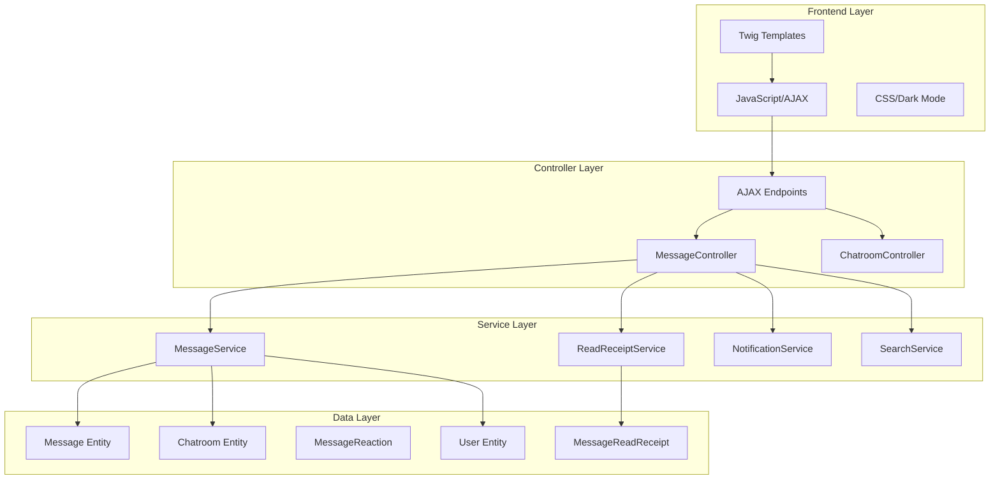

# Advanced Chatroom Features - Design Document

## Overview

This design enhances the existing Symfony chatroom application with modern communication platform features comparable to WhatsApp, Discord, and Slack. The system already has basic messaging functionality with reactions, pinning, editing, and file attachments. This design adds read receipts, real-time updates, threaded conversations, search, mentions, and improved UX features.

### Key Enhancements
- Read receipt system with visual indicators (✔ sent, ✔✔ read)
- Real-time message updates via AJAX polling
- Reply/thread system for organized conversations
- File upload improvements with preview and type detection
- System-generated messages for events
- Typing indicators
- Message search functionality
- Smart pagination with lazy loading
- @mention system with notifications
- Dark mode theme

### Technology Stack
- Symfony 7.4 with Doctrine ORM
- PHP 8.2+
- Twig templating
- VichUploaderBundle for file handling
- AJAX polling for real-time updates (no WebSocket dependency)
- Existing entities: Message, MessageReadReceipt, MessageReaction, Chatroom, User, Goal

---

## Architecture

### System Components



### Real-Time Architecture

The system uses AJAX polling instead of WebSockets for simplicity and compatibility:

1. **Polling Mechanism**: JavaScript polls `/chatroom/{goalId}/fetch` every 2-3 seconds
2. **Incremental Updates**: Only messages after `lastMessageId` are fetched
3. **Read Receipt Updates**: When messages are fetched, read receipts are created
4. **Typing Indicator**: Separate endpoint `/chatroom/{goalId}/typing` broadcasts typing status
5. **Unread Badge Updates**: Polling updates unread counts on goal list page

### Security Model

- **Authentication**: All endpoints require authenticated users
- **Authorization**: Users must be approved members of the goal
- **Message Ownership**: Only authors can edit/delete their own messages (moderators can delete any)
- **File Upload Validation**: Type and size restrictions enforced server-side
- **XSS Protection**: All user content sanitized via Twig auto-escaping

---

## Components and Interfaces

### 1. MessageService

Handles core message operations including creation, editing, deletion, and system messages.

```php
class MessageService
{
    public function createMessage(
        User $author,
        Chatroom $chatroom,
        ?string $content,
        ?File $attachment = null,
        ?Message $replyTo = null
    ): Message;
    
    public function editMessage(Message $message, string $newContent): void;
    
    public function deleteMessage(Message $message): void;
    
    public function createSystemMessage(
        Chatroom $chatroom,
        string $content,
        string $eventType
    ): Message;
    
    public function canEdit(Message $message, User $user): bool;
    
    public function canDelete(Message $message, User $user): bool;
}
```

### 2. ReadReceiptService

Manages read receipt tracking and status calculations.

```php
class ReadReceiptService
{
    public function markAsRead(Message $message, User $user): void;
    
    public function markAllAsRead(Chatroom $chatroom, User $user): void;
    
    public function getReadCount(Message $message): int;
    
    public function hasUserRead(Message $message, User $user): bool;
    
    public function getReadStatus(Message $message): string; // 'sent' or 'read'
    
    public function getUnreadCount(Chatroom $chatroom, User $user): int;
}
```

### 3. SearchService

Provides message search functionality with filtering and highlighting.

```php
class SearchService
{
    public function searchMessages(
        Chatroom $chatroom,
        string $query,
        ?User $author = null,
        ?\DateTime $startDate = null,
        ?\DateTime $endDate = null
    ): array;
    
    public function highlightMatches(string $content, string $query): string;
}
```

### 4. NotificationService

Handles user notifications for mentions and replies.

```php
class NotificationService
{
    public function notifyMentionedUsers(Message $message, array $mentionedUsers): void;
    
    public function notifyReply(Message $reply): void;
    
    public function extractMentions(string $content): array; // Returns User IDs
}
```

### 5. TypingIndicatorService

Manages typing status broadcasting.

```php
class TypingIndicatorService
{
    public function setTyping(Chatroom $chatroom, User $user): void;
    
    public function getTypingUsers(Chatroom $chatroom, User $excludeUser): array;
    
    public function clearTyping(Chatroom $chatroom, User $user): void;
}
```

### Controller Endpoints

#### Existing (Enhanced)
- `POST /message/{id}/edit` - Edit message (add 15-minute time limit)
- `POST /message/{id}/delete` - Delete message (add cascade for reactions)
- `GET /chatroom/{goalId}` - View chatroom (add pagination, unread marking)

#### New Endpoints
- `GET /chatroom/{goalId}/fetch` - Fetch new messages (AJAX polling)
- `POST /chatroom/{goalId}/typing` - Update typing status
- `GET /chatroom/{goalId}/search` - Search messages
- `GET /chatroom/{goalId}/load-more` - Load older messages (pagination)
- `POST /message/{id}/thread` - Create thread reply
- `GET /message/{id}/thread` - View thread sidebar
- `POST /chatroom/{goalId}/theme` - Toggle dark mode preference

---

## Data Models

### Enhanced Message Entity

```php
#[ORM\Entity]
class Message
{
    // Existing fields
    #[ORM\Id, ORM\GeneratedValue, ORM\Column]
    private ?int $id = null;
    
    #[ORM\Column(type: 'text', nullable: true)]
    private ?string $content = null;
    
    #[ORM\Column(type: 'datetime')]
    private ?\DateTimeInterface $createdAt = null;
    
    #[ORM\Column(type: 'boolean')]
    private bool $isPinned = false;
    
    #[ORM\Column(type: 'boolean')]
    private bool $isEdited = false;
    
    #[ORM\Column(type: 'datetime', nullable: true)]
    private ?\DateTimeInterface $editedAt = null;
    
    #[ORM\ManyToOne(inversedBy: 'messages')]
    private ?Chatroom $chatroom = null;
    
    #[ORM\ManyToOne]
    private ?User $author = null;
    
    #[ORM\ManyToOne(targetEntity: self::class, inversedBy: 'replies')]
    private ?Message $replyTo = null;
    
    #[ORM\OneToMany(targetEntity: self::class, mappedBy: 'replyTo')]
    private Collection $replies;
    
    // NEW: System message flag
    #[ORM\Column(type: 'boolean', options: ['default' => false])]
    private bool $isSystemMessage = false;
    
    // NEW: System event type (join, complete, progress, etc.)
    #[ORM\Column(type: 'string', length: 50, nullable: true)]
    private ?string $systemEventType = null;
    
    // NEW: Thread support
    #[ORM\Column(type: 'boolean', options: ['default' => false])]
    private bool $isThreadParent = false;
    
    #[ORM\Column(type: 'integer', options: ['default' => 0])]
    private int $threadReplyCount = 0;
    
    // File attachments (already exists via VichUploader)
    // Reactions (already exists)
}
```

### MessageReadReceipt Entity (Already Exists)

```php
#[ORM\Entity]
#[ORM\Table(name: 'message_read_receipt')]
#[ORM\UniqueConstraint(columns: ['message_id', 'user_id'])]
class MessageReadReceipt
{
    #[ORM\Id, ORM\GeneratedValue, ORM\Column]
    private ?int $id = null;
    
    #[ORM\ManyToOne(targetEntity: Message::class)]
    #[ORM\JoinColumn(nullable: false, onDelete: 'CASCADE')]
    private ?Message $message = null;
    
    #[ORM\ManyToOne(targetEntity: User::class)]
    #[ORM\JoinColumn(nullable: false, onDelete: 'CASCADE')]
    private ?User $user = null;
    
    #[ORM\Column(type: 'datetime')]
    private ?\DateTimeInterface $readAt = null;
}
```

### New: TypingStatus Entity (Temporary Storage)

```php
#[ORM\Entity]
#[ORM\Table(name: 'typing_status')]
class TypingStatus
{
    #[ORM\Id, ORM\GeneratedValue, ORM\Column]
    private ?int $id = null;
    
    #[ORM\ManyToOne(targetEntity: Chatroom::class)]
    #[ORM\JoinColumn(nullable: false, onDelete: 'CASCADE')]
    private ?Chatroom $chatroom = null;
    
    #[ORM\ManyToOne(targetEntity: User::class)]
    #[ORM\JoinColumn(nullable: false, onDelete: 'CASCADE')]
    private ?User $user = null;
    
    #[ORM\Column(type: 'datetime')]
    private ?\DateTimeInterface $lastTypingAt = null;
    
    // Unique constraint: one typing status per user per chatroom
}
```

### Enhanced User Entity

```php
#[ORM\Entity]
class User
{
    // Existing fields...
    
    // NEW: Dark mode preference
    #[ORM\Column(type: 'boolean', options: ['default' => false])]
    private bool $darkModeEnabled = false;
}
```

### Database Migrations Required

1. **Add system message fields to Message**:
   - `is_system_message` (boolean, default false)
   - `system_event_type` (varchar(50), nullable)
   - `is_thread_parent` (boolean, default false)
   - `thread_reply_count` (integer, default 0)

2. **Create TypingStatus table**:
   - Standard entity fields
   - Unique constraint on (chatroom_id, user_id)

3. **Add dark mode to User**:
   - `dark_mode_enabled` (boolean, default false)

---

## Correctness Properties

*A property is a characteristic or behavior that should hold true across all valid executions of a system—essentially, a formal statement about what the system should do. Properties serve as the bridge between human-readable specifications and machine-verifiable correctness guarantees.*

### Property 1: Read Receipt Visual Indicators

*For any* message sent by the current user, the rendered message should display ✔ (single checkmark) if no read receipts exist, and ✔✔ (double checkmark) if at least one read receipt exists.

**Validates: Requirements 1.1, 1.5**

### Property 2: Automatic Read Receipt Creation

*For any* user opening any chatroom, read receipts should be created for all messages in that chatroom where the user is not the author.

**Validates: Requirements 1.2**

### Property 3: Read Status Visibility Restriction

*For any* message in any chatroom, read status indicators should only be visible when the current viewing user is the message author.

**Validates: Requirements 1.3**

### Property 4: Read Receipt Persistence

*For any* read receipt created in the system, persisting it to the database and then retrieving it should return an equivalent read receipt with the same message, user, and timestamp.

**Validates: Requirements 1.4**

### Property 5: Unread Badge Display

*For any* goal with unread messages, the goal card should display a red badge containing the count of unread messages for that specific goal's chatroom, and the badge should disappear when all messages are read.

**Validates: Requirements 2.1, 2.2, 2.3, 2.4**

### Property 6: Unread Count Isolation

*For any* goal, the unread message count should only include messages from that goal's chatroom and should not include messages from other goals' chatrooms.

**Validates: Requirements 2.5**

### Property 7: Real-Time Message Fetching

*For any* chatroom, when new messages are created, the AJAX fetch endpoint should return those messages without requiring a page reload, and they should appear in the UI.

**Validates: Requirements 3.1**

### Property 8: Scroll Position Preservation

*For any* chatroom where the user has scrolled up from the bottom, when new messages arrive, the scroll position should remain unchanged rather than jumping to the bottom.

**Validates: Requirements 3.5**

### Property 9: Reply Message Rendering

*For any* reply message, the rendered output should include a reply button, the quoted parent message content above the reply, and a visual connection element linking to the original message.

**Validates: Requirements 4.1, 4.2, 4.4**

### Property 10: Reply Click Navigation

*For any* reply message, clicking the quoted parent message section should scroll the viewport to the original parent message.

**Validates: Requirements 4.3**

### Property 11: Reply Relationship Persistence

*For any* reply message with a parent message, persisting the reply to the database and then retrieving it should return the same parent message relationship.

**Validates: Requirements 4.5**

### Property 12: Edit Button Visibility

*For any* message, an edit button should be present in the rendered output if and only if the current user is the message author.

**Validates: Requirements 5.1**

### Property 13: Edited Label Display

*For any* message where `isEdited` is true, the rendered output should include an "Edited" label or indicator.

**Validates: Requirements 5.3**

### Property 14: Edit Time Limit Enforcement

*For any* message older than 15 minutes, attempting to edit the message should be rejected with an error, while messages 15 minutes old or newer should allow editing.

**Validates: Requirements 5.5**

### Property 15: Cascade Delete Reactions

*For any* message with reactions, when the message is deleted, all associated reactions should also be deleted from the database.

**Validates: Requirements 6.3**

### Property 16: File Type Validation

*For any* file upload attempt, files with supported types (jpg, png, pdf, docx, xlsx) should be accepted, while files with unsupported types should be rejected with an error.

**Validates: Requirements 7.2**

### Property 17: File Size Validation

*For any* file upload attempt, files larger than 10MB should be rejected with an error, while files 10MB or smaller should be accepted.

**Validates: Requirements 7.3**

### Property 18: Attachment Rendering by Type

*For any* message with a file attachment, the rendered output should include an image preview if the attachment is an image, or a download link if the attachment is a document.

**Validates: Requirements 7.4, 7.5**

### Property 19: File Storage Location

*For any* successfully uploaded file, the file should be stored in the `/uploads/chatroom/` directory (or configured upload path).

**Validates: Requirements 7.6**

### Property 20: System Message Creation for Events

*For any* goal event (user joins, goal completed, progress updated), a system message should be automatically created in that goal's chatroom with appropriate content.

**Validates: Requirements 8.1, 8.2, 8.3**

### Property 21: System Message Rendering

*For any* system message, the rendered output should have distinct styling (gray, centered), should not display an author, and should not include reaction buttons.

**Validates: Requirements 8.4, 8.5**

### Property 22: Typing Indicator Display

*For any* user typing in any chatroom, other users viewing that chatroom should see a typing indicator showing the typing user's name, and when multiple users are typing, all names should be displayed in the format "X, Y, and Z are typing...".

**Validates: Requirements 9.1, 9.2, 9.5**

### Property 23: Typing Indicator Timeout

*For any* typing status, if no typing activity occurs for 3 seconds, the typing indicator should disappear from the UI.

**Validates: Requirements 9.3**

### Property 24: Message Search Filtering

*For any* search query with content, author, and/or date filters, the returned results should only include messages that match all specified criteria, matching text should be highlighted, and the result count should be displayed.

**Validates: Requirements 10.2, 10.3, 10.5**

### Property 25: Search Result Navigation

*For any* search result, clicking on it should scroll the viewport to that message in the chatroom.

**Validates: Requirements 10.4**

### Property 26: Initial Message Load Count

*For any* chatroom when first opened, exactly the last 20 messages (or fewer if the chatroom has fewer than 20 messages) should be loaded and displayed.

**Validates: Requirements 11.1**

### Property 27: Pagination Scroll Preservation

*For any* "load older messages" action, after the older messages are loaded, the scroll position should remain at the same message that was at the top of the viewport before loading.

**Validates: Requirements 11.3**

### Property 28: Mention Autocomplete Triggering

*For any* chatroom input field, when the user types "@", a list of chatroom participants should be displayed for selection.

**Validates: Requirements 12.1**

### Property 29: Mention Autocomplete Filtering

*For any* partial username typed after "@", the autocomplete suggestions should only include participants whose names match the partial input.

**Validates: Requirements 12.2**

### Property 30: Mention Highlighting

*For any* message containing a user mention, the mentioned username should be highlighted in the rendered output.

**Validates: Requirements 12.3**

### Property 31: Mention Notification

*For any* message containing a user mention, the mentioned user should receive a notification about the mention.

**Validates: Requirements 12.4**

### Property 32: Mention Click Navigation

*For any* rendered mention in a message, clicking it should navigate to the mentioned user's profile page.

**Validates: Requirements 12.5**

### Property 33: Thread Sidebar Display

*For any* message, clicking the thread button should open a sidebar displaying the thread conversation.

**Validates: Requirements 13.2**

### Property 34: Thread Reply Count Badge

*For any* message with thread replies, a badge displaying the count of replies should be visible on the parent message.

**Validates: Requirements 13.3**

### Property 35: Thread Reply Functionality

*For any* thread, authorized participants should be able to add reply messages to that thread.

**Validates: Requirements 13.4**

### Property 36: Thread Notification Separation

*For any* thread reply, the notification generated should be distinct from main chatroom message notifications.

**Validates: Requirements 13.5**

### Property 37: Dark Mode Styling

*For any* chatroom when dark mode is enabled, the rendered UI should have dark background colors, light text colors, and adjusted message colors appropriate for dark mode.

**Validates: Requirements 14.2, 14.3**

### Property 38: Dark Mode Preference Persistence

*For any* user's dark mode preference, persisting the preference to the database and then retrieving it should return the same preference value.

**Validates: Requirements 14.4**

---

## Error Handling

### Validation Errors

1. **Empty Message Submission**: When content is empty and no attachment is provided, return 400 error with message "Le message doit contenir du texte ou un fichier."

2. **File Upload Errors**:
   - Unsupported file type: 400 error "Type de fichier non supporté"
   - File too large: 400 error "Fichier trop volumineux (max 10MB)"
   - Upload failure: 500 error "Erreur lors de l'upload du fichier"

3. **Edit Time Limit**: When attempting to edit a message older than 15 minutes, return 403 error "Vous ne pouvez plus modifier ce message (délai de 15 minutes dépassé)"

4. **Permission Errors**:
   - Non-member access: 403 error "Vous devez rejoindre ce goal pour accéder au chatroom"
   - Unapproved member: 403 error "Votre demande d'accès est en attente d'approbation"
   - Edit other's message: 403 error "Vous ne pouvez modifier que vos propres messages"
   - Delete without permission: 403 error "Vous ne pouvez pas supprimer ce message"

5. **Locked/Archived Chatroom**: When attempting to send message to locked/archived chatroom, return 403 error with appropriate message

### Database Errors

1. **Constraint Violations**: Catch unique constraint violations on MessageReadReceipt and handle gracefully (user already marked as read)

2. **Foreign Key Violations**: Ensure cascade deletes are properly configured for Message → MessageReaction and Message → MessageReadReceipt

3. **Transaction Failures**: Wrap multi-step operations (e.g., file upload + message creation) in transactions with rollback on failure

### AJAX Errors

1. **Polling Failures**: If fetch endpoint fails, retry with exponential backoff (2s, 4s, 8s) up to 3 times before showing error

2. **Network Timeouts**: Set 10-second timeout on AJAX requests, show "Connexion lente" warning if exceeded

3. **Authentication Errors**: If 401 received during polling, redirect to login page

### File System Errors

1. **Directory Creation**: If upload directory doesn't exist, create it with proper permissions (755)

2. **Disk Space**: Check available disk space before upload, return 507 error if insufficient

3. **File Permissions**: Ensure uploaded files have correct permissions (644) for web server access

---

## Testing Strategy

### Dual Testing Approach

This feature requires both unit tests and property-based tests for comprehensive coverage:

- **Unit tests**: Verify specific examples, edge cases, and error conditions
- **Property tests**: Verify universal properties across all inputs using randomized testing

Both approaches are complementary and necessary. Unit tests catch concrete bugs in specific scenarios, while property tests verify general correctness across a wide range of inputs.

### Property-Based Testing

**Library**: Use [PHPUnit with Eris](https://github.com/giorgiosironi/eris) for property-based testing in PHP

**Configuration**: Each property test should run a minimum of 100 iterations to ensure adequate coverage through randomization.

**Test Tagging**: Each property-based test must include a comment tag referencing the design document property:

```php
/**
 * @test
 * Feature: chatroom-advanced-features, Property 1: Read Receipt Visual Indicators
 */
public function property_read_receipt_visual_indicators()
{
    $this->forAll(
        Generator\associative([
            'hasReadReceipts' => Generator\bool(),
            'isCurrentUserAuthor' => Generator\bool(),
        ])
    )->then(function ($data) {
        // Test implementation
    });
}
```

### Unit Testing Focus

Unit tests should focus on:

1. **Specific Examples**:
   - Test that opening a chatroom with 5 unread messages creates 5 read receipts
   - Test that a message sent at 10:00 AM cannot be edited at 10:16 AM
   - Test that uploading a 15MB file is rejected

2. **Edge Cases**:
   - Empty chatroom (no messages)
   - Chatroom with only system messages
   - User mentions themselves
   - Reply to a deleted message
   - Typing indicator with 10+ simultaneous users

3. **Integration Points**:
   - MessageService → ReadReceiptService interaction
   - File upload → Message creation transaction
   - AJAX polling → Read receipt creation flow

4. **Error Conditions**:
   - Database connection failures
   - File system permission errors
   - Invalid user permissions
   - Malformed AJAX requests

### Property-Based Testing Focus

Property tests should verify:

1. **Read Receipt Properties** (Properties 1-4):
   - Generate random messages with varying read receipt states
   - Verify visual indicators match read receipt data
   - Test read receipt creation for random user/chatroom combinations

2. **Badge and Unread Count Properties** (Properties 5-6):
   - Generate random chatrooms with varying message counts
   - Verify unread counts are correctly calculated and isolated per goal

3. **Real-Time Update Properties** (Properties 7-8):
   - Generate random message sequences
   - Verify fetch endpoint returns correct incremental updates
   - Test scroll preservation with random scroll positions

4. **Reply System Properties** (Properties 9-11):
   - Generate random message trees with replies
   - Verify reply rendering includes all required elements
   - Test reply persistence round-trips

5. **Edit and Delete Properties** (Properties 12-15):
   - Generate messages with random timestamps
   - Verify edit time limit enforcement
   - Test cascade delete behavior

6. **File Upload Properties** (Properties 16-19):
   - Generate random file types and sizes
   - Verify validation rules are enforced
   - Test attachment rendering based on type

7. **System Message Properties** (Properties 20-21):
   - Generate random goal events
   - Verify system messages are created and rendered correctly

8. **Typing Indicator Properties** (Properties 22-23):
   - Generate random typing user sets
   - Verify indicator display and timeout behavior

9. **Search Properties** (Properties 24-25):
   - Generate random message sets and search queries
   - Verify filtering, highlighting, and result counts

10. **Pagination Properties** (Properties 26-27):
    - Generate chatrooms with varying message counts
    - Verify initial load count and scroll preservation

11. **Mention Properties** (Properties 28-32):
    - Generate random mention patterns
    - Verify autocomplete, highlighting, and notifications

12. **Thread Properties** (Properties 33-36):
    - Generate random thread structures
    - Verify thread display, counts, and notifications

13. **Dark Mode Properties** (Properties 37-38):
    - Generate random UI states
    - Verify styling and preference persistence

### Test Data Generators

Create custom generators for:

- **Message Generator**: Random content, author, timestamps, attachments
- **User Generator**: Random users with varying permissions
- **Chatroom Generator**: Random chatrooms with varying message counts
- **File Generator**: Random files with varying types and sizes
- **Mention Generator**: Random @mention patterns in message content

### Continuous Integration

- Run all tests on every commit
- Property tests should use fixed seed for reproducibility
- Maintain test coverage above 80% for new code
- Run performance tests for AJAX polling under load

---

